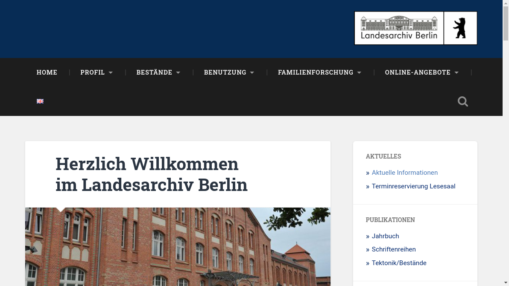
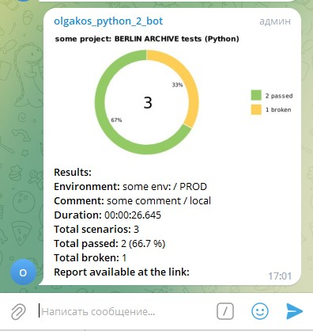

small_pet_remote_py

# Landesarchiv Berlin


## Site:
* https://landesarchiv-berlin.de/



## Tests:
- [x] Basic search
- [x] Article Search
- [x] Language change to EN

## Technologies and tools
<br>`Python` - programming language
<br>`Selene` - framework for testing
<br>`Pytest` - for unit testing
<br>`Jenkins` - CI/CD for running tests remotely
<br>`Selenoid` - to launch browsers remotely in Docker container
<br>`Allure Report` - to visualize test results
<br>`Telegram Bot` - for test results notifications

### Running tests from the terminal
Run UI tests locally
```
pytest . 
```
### Running Allure Report from the terminal
<b>note:</b> for Windows
``` 
allure\bin\allure.bat serve allure-results
```

### Remote start (Jenkins job)

* https://jenkins.autotests.cloud/job/C02_OlgaKos_Python_small_pet_remote_py/

### Integration with Telegram


------------
###### todo:
* Add tool's icons
* Add parameterization 
* Do refactoring

ver 2023-08-01